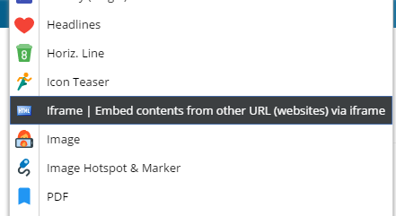
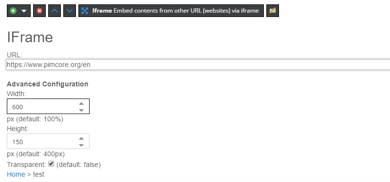

# Create Your Own Bricks

## Architecture of a Brick

A brick is an instance of `Pimcore\Extension\Document\Areabrick\AreabrickInterface` which can either be auto-loaded
by saving the brick to a special namespace inside your bundle or by defining the brick as a service and adding it to the
list of available bricks through a DI tag. The brick class is the only mandatory file for a brick, however most bricks
will at least implement a view template which is rendered in frontend and editmode.

The templates itself are normal templates which are passed to the rendering engine. Therefore you can use all 
existing templating helpers and [Pimcore editables](../README.md).


## Brick registration

A brick will be registered on the system and is represented by a brick ID which has to be unique throughout the
system. If a brick ID is registered twice (e.g. by multiple bundles), an error will be raised. The simple way to 
register a brick is to just save it to a special namespace `Document\Areabrick` inside your bundle. Every bundle will
be scanned for classes implementing `AreabrickInterface` and all found bricks will be automatically registered to 
the system. The brick ID will be built from the class name of the implementing class by converting the class name to 
dashed case. For example a brick named `MyCustomAreaBrick` will be automatically registered as `my-custom-area-brick`.

A basic brick implementation could look like the following. As it is defined in the special namespace, Pimcore will
implicitely auto-create a service `app.area.brick.iframe` and register it on the areabrick manager with the ID `iframe`.

```php
<?php

namespace AppBundle\Document\Areabrick;

use Pimcore\Extension\Document\Areabrick\AreabrickInterface;

class Iframe implements AreabrickInterface
{
    // implementing class methods
}
```

> Please note that you need to clear the cache after you added a brick to the special namespace.

If you need more control over the brick instance (e.g. because your brick has dependencies on other services or you
want to specify the brick ID manually), you can add the service definition yourself and tag the service with the DI
tag `pimcore.area.brick`. Bricks defined manually will be excluded from the auto-registration, even if they're
defined in the special namespace. Let's define our brick as above, but assume it needs acess to a logger instance:

```yml
# a service.yml file defining services
services:
    app.area.brick.iframe:
        class: AppBundle\Document\Areabrick\Iframe
        arguments: ['@logger']
        tags:
            - { name: pimcore.area.brick, id: iframe }
```

This will register the brick as above, but you have control over the brick ID and are able to make use of the
container for dependencies.

> Although it might be tempting to overwrite the `getId()` method in your bricks, please make sure the brick always
refers to the ID which is set via `setId($id)` when the brick is registered. Overriding `getId()` won't affect the
brick ID as it is registered on the system as bricks are lazy-loaded. The areabrick manager will set the registered 
ID when the brick instance is fetched.

## Brick template auto discovery

For convenience, you can create a new brick by extending `Pimcore\Extension\Document\Areabrick\AbstractTemplateAreabrick`
to make use of template auto-discovery (thus, needing a minimum of code to get started). The template area brick 
implements the `TemplateAreabrickInterface` which defines the following methods you can use to control template 
auto-discovery. Please make sure your brick is defined inside a bundle as otherwise your templates can't be 
auto-discovered.

```php
interface TemplateAreabrickInterface extends AreabrickInterface
{
    const TEMPLATE_LOCATION_GLOBAL = 'global';
    const TEMPLATE_LOCATION_BUNDLE = 'bundle';

    const TEMPLATE_SUFFIX_PHP  = 'html.php';
    const TEMPLATE_SUFFIX_TWIG = 'html.twig';

    /**
     * Determines if template should be auto-located in area bundle or in app/Resources
     *
     * @return string
     */
    public function getTemplateLocation();

    /**
     * Returns view suffix used to auto-build view names
     *
     * @return string
     */
    public function getTemplateSuffix();
}
```

The template location defines the base path which will be used to find your templates. It resolves to the following 
locations. `<bundlePath>` is the filesystem path of the bundle the brick resides in, `<brickId>` the ID of the brick 
as registered on the areabrick manager (see below).

| Location | Path                                           |
|----------|------------------------------------------------|
| global   | `app/Resources/views/Areas/<brickId>`          |
| bundle   | `<bundlePath>/Resources/views/Areas/<brickId>` |


Depending on the template location, the following files will be used. You can always completely control locations by 
implementing the methods for templates and icon yourself (see `AreabrickInterface`):

| Type |  Location |
|---------------------------|-------------------------------------------------------------------------------------------------|
| view template | `<templateLocation>/view.<suffix>` |
| edit template | `<templateLocation>/edit.<suffix>` | 


If the brick defines an icon in the `public` resources directory of the bundle, the icon will be automatically used 
in editmode. If the icon is at another location, you can override the `getIcon()` method and specify an URL to be 
included as icon. When rendering editmode, the following location will be searched for the brick icon and is expected
 to be a 16x16 pixel PNG: `<bundlePath>/Resources/public/areas/<brickId>/icon.png` which resolves to the URL  
 `/bundles/<bundleUrl>/areas/<brickId>/icon.png` when included in editmode.
 
Given our `iframe` brick defined before, the following paths will be used.

### `global` template location

| Location      | Path                                                    |
|---------------|---------------------------------------------------------|
| view template | `app/Resources/views/Areas/iframe/view.html.(php|twig)` |
| view template | `app/Resources/views/Areas/iframe/edit.html.(php|twig)` |
| icon path     | `web/bundles/app/areas/iframe/icon.png`                 |
| icon URL      | `/bundles/app/areas/iframe/icon.png`                    |

### `bundle` template location

The icon path and URL are the same as above, but the view scripts are expected inside the bundle.

| Location      | Path                                                    |
|---------------|---------------------------------------------------------|
| view template | `src/AppBundle/Resources/views/Areas/iframe/view.html.(php|twig)` |
| view template | `src/AppBundle/Resources/views/Areas/iframe/edit.html.(php|twig)` |

## How to Create a Brick
 
Let's suppose, that our iframe brick defined above is responsible for generating an `<iframe>` containing contents 
from a specified url in the editmode. First of all, let's update the class to add metadata for the extension manager, to
make use of template auto-discovery and to load the view template from `app/Resources/views` instead of the bundle
directory:

```php
<?php
// src/AppBundle/Document/Areabrick/Iframe.php

namespace AppBundle\Document\Areabrick;

use Pimcore\Extension\Document\Areabrick\AbstractTemplateAreabrick;

class Iframe extends AbstractTemplateAreabrick
{
    public function getName()
    {
        return 'IFrame';
    }

    public function getDescription()
    {
        return 'Embed contents from other URL (websites) via iframe';
    }

    public function getTemplateLocation()
    {
        return static::TEMPLATE_LOCATION_GLOBAL;
    }
}
```

Let's create a view as next step. Views behave exactly as native controller views and you have access to the current 
document, to editmode and to editables and templating helpers as everywhere else. In addition there's a `brick` 
variable on the view which gives you access to the brick instance. A `info` variable (see below) gives you access to 
brick metadata. Our view is rendered through the PHP engine and has a suffix of `.html.php` however you're free to 
use Twig or other templating engines as you wish.

```php
<?php // app/Resources/views/Areas/iframe/view.html.php ?>
<?php if ($this->editmode): ?>
    <div>
        <h2>IFrame</h2>
        <div>
            URL: <?= $this->input("iframe_url"); ?>
        </div>
        <br/>
        <b>Advanced Configuration</b>
        <div>
            Width: <?= $this->numeric("iframe_width"); ?>px (default: 100%)
        </div>
        <div>
            Height: <?= $this->numeric("iframe_height"); ?>px (default: 400px)
        </div>
        <div>
            Transparent: <?= $this->checkbox("iframe_transparent"); ?> (default: false)
        </div>
    </div>
<?php else: ?>
    <?php if (!$this->input("iframe_url")->isEmpty()): ?>

        <?php
        // defaults
        $transparent = "false";
        $width       = "100%";
        $height      = "400";

        if (!$this->numeric("iframe_width")->isEmpty()) {
            $width = (string)$this->numeric("iframe_width");
        }
        if (!$this->numeric("iframe_height")->isEmpty()) {
            $height = (string)$this->numeric("iframe_height");
        }
        if ($this->checkbox("iframe_transparent")->isChecked()) {
            $transparent = "true";
        }
        ?>

        <iframe src="<?= $this->input("iframe_url"); ?>" width="<?= $width; ?>" height="<?= $height; ?>" allowtransparency="<?= $transparent; ?>" frameborder="0"></iframe>

    <?php endif; ?>
<?php endif; ?>
```

Now you should be able to see your brick in the list of available bricks on your areablock:


In editmode you can see the configuration for the Iframe brick:



## The Brick ***info-object***

Brick views and methods will have access to an `Info` object containing metadata about the current brick. It is 
exposed as `info` variable on views and passed to brick methods as argument. Many methods exist for historical 
reasons, but a couple of methods could be useful when implementing your own bricks.

| Method                  | Description                                      |
|-------------------------|--------------------------------------------------|
| `$info->getTag()`       | Returns the tag rendering the brick              |
| `$info->getRequest()`   | Returns the current request                      |
| `$info->getView()`      | Returns the ViewModel to be rendered             |
| `$info->getIndex()`     | Returns the current index inside the areablock   |

## Configuration in Editmode

You can use the edit template to allow users to add data to the brick. The edit template file can include HTML and 
editables. When this file is present an icon will appear for the user which can be clicked to display and edit the 
editable fields.

To configure your brick to use an edit template, the brick must be configured to have an edit template. The edit 
template will be resolved the same way as the view template.

```php
<?php

namespace AppBundle\Document\Areabrick;

use Pimcore\Extension\Document\Areabrick\AbstractTemplateAreabrick;

class Iframe extends AbstractTemplateAreabrick
{
    // other methods defined above

    public function hasEditTemplate()
    {
        return true;
    }
}
```

> Using an edit template will disable all editables in the view template in editmode (they appear like in the 
frontend, but cannot be edited). 

Example contents of an edit template (e.g. `edit.html.php`):
```php
Class: <?= $this->input('class'); ?>
```

Accessing the data in the view template:

```php
<?php
    $class = '';
    if(!$this->input('class')->isEmpty()) {
        $class = $this->input('class')->getData();
    }
?>
```

## Methods on the brick class

Sometimes a brick is more than just a view-script and contains some functionality which shouldn't be directly in the view. 
In this case you can use the `action()` and `postRenderAction()` method on the brick class which both get the info 
object as parameter. The `action()` method is no real controller action, it is just a little helper to get some logic
 and code out of the 
view. However, you can use the action method to prepare data for the view (for example parse request params).

If you need to influence the HTML open and close tag, you can do so by customizing `getHtmlTagOpen()` and 
`getHtmlTagClose()` (see example below). 
 
```php
<?php

namespace AppBundle\Document\Areabrick;

use Pimcore\Extension\Document\Areabrick\AbstractTemplateAreabrick;
use Pimcore\Model\Document\Tag\Area\Info;

class Iframe extends AbstractTemplateAreabrick
{
    // other methods defined above
    // 
    public function action(Info $info)
    {
        $myVar = $info->getRequest()->get('myParam');

        $info->getView()->myVar = $myVar;
    }

    // OPTIONAL METHODS

    // executed after a brick is rendered
    public function postRenderAction(Info $info)
    {
    }

    // returns a custom html wrapper element (return an empty string if you don't want a wrapper element)
    public function getHtmlTagOpen(Info $info)
    {
        return '<span class="customWrapperDiv">';
    }

    public function getHtmlTagClose(Info $info)
    {
        return '</span>';
    }
}
```

## Migration from Pimcore 4 bricks

Migration of existing bricks should be quite straightforward if you don't switch the templating engine. The following
 steps should get you started:
 
* Create a brick class which contains the data you need from the `area.xml` file and make sure the `ID` of the new 
brick matches the `<id></id>` attribute from `area.xml` either by naming your class accordingly or by registering the
 service manually.
* Move the view scripts and an optional icon from `website/views/areas` to their new location (see above). Depending 
on the complexity of your view scripts you might need to adapt them to the new templating engine (see MVC docs). Please
note that the extension for PHP templating view scripts changed from `.php` to `.html.php`.

> Bricks defined this way are only valid for views rendered through the Symfony stack. If you need bricks to work in 
the compatibility they still need to be implemented the Pimcore 4 way in `website/views`.

## Examples

You can find many examples in the [demo / quick start package](https://github.com/pimcore/pimcore/tree/master/install-profiles/demo-cms/src/AppBundle/Document/Areabrick).
