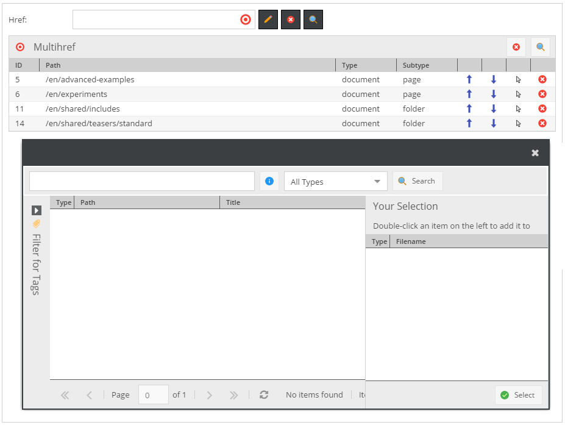
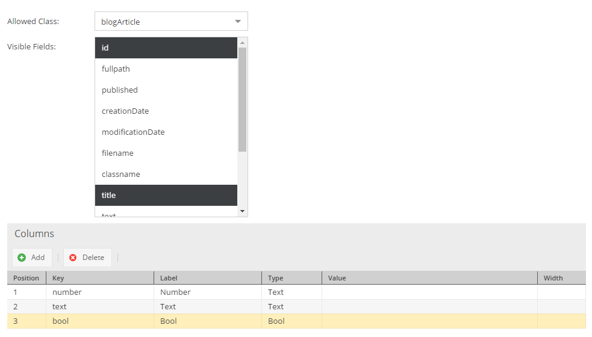
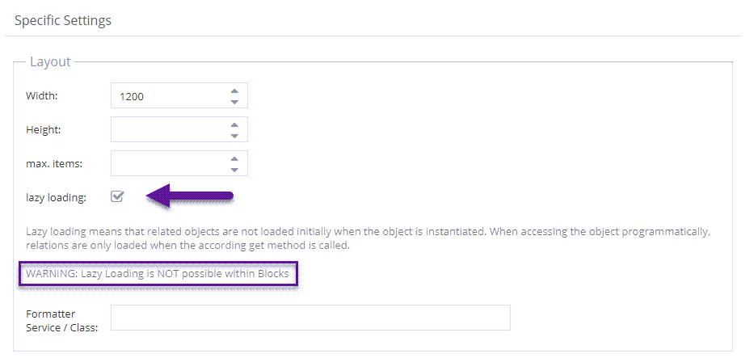

# Relation Datatypes

## Href, Multihref and Object Data Fields 

Href, multihref and objects are pure relation data types, which means they represent a relation to an other Pimcore 
element (document, asset, object). The href and multihref data types can store relations to any other Pimcore element. 
In the object field definition there is the possibility to configure which types and subtypes of elements are allowed.
The configuration screen for restrictions is shown below. 

The difference between href and multihref is, that a href represents a :1 relation, whereas a a multihref can be a :n 
relation. 

The objects field allows relations to one or more objects, but no other elements. Therefore the restriction settings for 
objects are limited to object classes.


Multihref and objects are grid widgets in the UI. The width and height of the input widget can be configured in the 
object class settings. For a href only the width can be configured, since it is represented by a single drop area. 
Lazy Loading is explained further below in the section about relations and lazy loading.


The input widgets for all three relation data types are represented by drop areas, which allow to drag and drop elements 
from the tree on the left to the drop target in the object layout. The href constitutes a single drop area, whereas 
multihref and objects are grid widgets containing rows of data.

In addition to the drag and drop feature, elements can be searched and selected directly from the input widget. In case 
of objects it is even possible to create a new object and select it for the objects widget.
 



#### Filtering for relations via PHP API
These pure relation types are stored in a separate database table called `object_relations_ID`. In the according 
`object_~ID~` database view, which is used for querying data, the relations fields are summarized as a comma 
separated list of IDs of related elements. Therefore, if one needs to create an object list with a filter condition on a 
relation column this can be achieved as follows:

```php
$relationId = 162;
$list = new \Pimcore\Model\DataObject\Example\Listing();
$list->setCondition("myHref__id = ".$relationId);
$objects=$list->load();
 
 
$relationId = 345;
$list = new \Pimcore\Model\DataObject\Example\Listing();
$list->setCondition("myMultihref like '%,".$relationId.",%'");
$objects=$list->load();
```

#### Assigning relations via PHP API
In order to set a href data field, a single Pimcore element needs to be passed to the setter. With multihref and objects 
an array of elements is passed to the setter:

```php
use Pimcore\Model\DataObject;
use Pimcore\Model\Document;
use Pimcore\Model\Asset;
  
$myHrefElement = Document::getById(23);
 
$myMultihrefElements[] = Asset::getById(350);
$myMultihrefElements[] = DataObject::getByPath("/products/testproduct");
 
$myObjectsElements[] = DataObject\Product::getById(98);
$myObjectsElements[] = DataObject\Product::getById(99);
 
$object->setHref($myHrefElement);
$object->setMultihref($myMultihrefElements);
$object->setObjects($myObjectsElements);
 
$object->save();
```

#### Deleting relations via PHP API
In order to remove all elements from this object's multihref field, the setter can be called with null or an array:

```php
$object->setMultihref([]);
 
//that would have the same result
$object->setMultihref(null);
```
Internally the setter sets the value to an empty array, regardless if an empty array or null is passed to it.

> **Be Careful - Use Getters and Setters!**  
> `$object->multihref = null;`  
> Will not work to clear the list of elements in the multihref when lazy loading ist activated. If the value of an object 
> or multihref data type is null, for Pimcore this means that the data of this field has not been loaded an that it is 
> not to be touched when saving the object.


#### Unpublished relations
Related items that are unpublished are normally not returned. You can disable this behavior like this:
```php
//also include unpublished relations form now on
Object\AbstractObject::setHideUnpublished(false);
//get a related object that is either published or unpublished
$relationObject = $relation->getObject();
//return to normal behavior
Object\AbstractObject::setHideUnpublished(true);
```


##Objects with Metadata 
This data type is an extension to the objects data type. To each assigned object additional metadata can be saved. 
The type of the metadata can be text, number, selection or a boolean value.

A restriction of this data type is that only one allowed class is possible. As a result of this restriction, it is 
possible to show data fields of the assigned objects.
Which metadata columns are available and which fields of the assigned objects are shown has to be defined during the 
class definition.



The shown class definition results in the following object list in the object editor. The first two columns contain 
`id` and `title` of the assigned object. The other four columns are metadata columns and can be edited within this 
list.


All the other functionality is the same as with the normal objects data type.


#### Access objects with metadata via PHP API
```php
use Pimcore\Model\DataObject;
  
$object = DataObject::getById(73585);
 
//getting list of assigned objects with metadata (array of DataObject\Data\ObjectMetadata)
$objects = $object->getMetadata();
 
//get first object of list
$relation = $objects[0];
 
//get relation object
$relationObject = $relation->getObject();
 
//access meta data via getters (getter = key of metadata column)
$metaText = $relation->getText();
$metaNumber = $relation->getNumber();
$metaSelect = $relation->getSelect();
$metaBool = $relation->getBool();
 
//setting data via setter
$relation->setText("MetaText2");
$relation->setNumber(5512);
$object->save();
```

#### Save objects with metadata

```php
use Pimcore\Model\DataObject;
  
//load your object (in this object we save the metadata objects)
$object = DataObject::getById(73585);
  
//create a empty array for your metadata objects
$objectArray = [];
  
//loop throu the objectlist (or array ...) and create object metadata
foreach( $yourObjectsList as $yourObject ){
  
    //create the objectmetadata Object, "yourObject" is the referenced object
    $objectMetadata = new DataObject\Data\ObjectMetadata('metadata', ['text', 'number'],  $yourObject);
    //set into the metadata field (named text) the value "Metadata"
    $objectMetadata->setText('Metadata');
    //set into the metadata field (named Number) the value 23
    $objectMetadata->setNumber(23);
  
    //add to the empty "objectArray" array
    $objectArray[] = $objectMetadata;
}
  
//set the metadataArray to your object
$object->setMetadata($objectArray);
  
// now save all
$object->save();
```


## Multihref Advanced

***Formerly known as `Multihref with Metadata`***

***Important Note***: Since 5.0.0 referenced elements will be lazy-loaded! 

This datatype is similar to the `Objects with Metadata` datatype in the way that additional information can be 
added to the relation.

The main difference is that all element types (documents, assets and objects) can be added to the relation list. 
The element types can also be mixed. Essentially, the same rules as for the standard multihref apply.

The API is nearly identical. However, instead of dealing with an `ObjectMetadata` class you have to do the same stuff 
with `ElementMetadata`.

```php
use Pimcore\Model\DataObject;
 
$referencedElement = Document::getById(123);
$references = [];
$elementMetadata = new DataObject\Data\ElementMetadata('metadata', ['text', 'number'], referencedElement );
 
//set into the metadata field (named text) the value "my lovely text"
$elementMetadata->setText('my lovely text');
 
//set into the metadata field (named Number) the value 23
$elementMetadata->setNumber(23);
 
 
$references[] = $elementMetadata;
 
//set the metadata array to your object
$object->setMetadata($references); // object’s multihref field is called „metadata“
```


## Lazy Loading
Whenever an object is loaded from database or cache, all these related objects are loaded with it. Especially with 
MultiHrefs and Objects it is easy to produce a huge amount of relations, which makes the object or an object list slow 
in loading. 

As a solution to this dilemma, multihref and object data types can be classified as `lazy loading` attributes 
in the class definition.



Object attributes which are lazy, are only loaded from the `database/cache` when their getter is called. In the 
example above this would mean, that the multihref data is only loaded when calling `$object->getMultihref();`, 
otherwise the attribute (`$object->multihref`) remains `null`.


## Dependencies

There are several object data types which represent a relation to an other Pimcore element. The pure relation types are
* Href
* MultiHref
* Objects

Furthermore, the following data types represent a relation, but they are not reflected in the `object_relation_..` 
tables, since they are by some means special and not pure relations. (One could argue that the image is, but for now it 
is not classified as a pure relation type)
* Image
* Link
* Wysiwyg

All of these relations produce a dependency. In other words, the dependent element is shown in both element's dependencies 
tab and Pimcore issues a warning when deleting an element which has dependencies.


