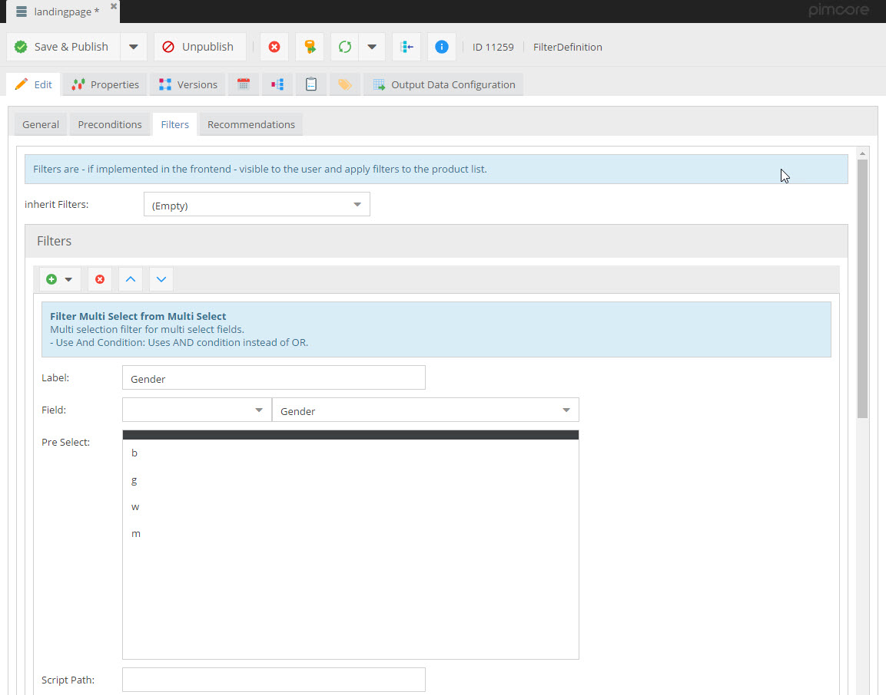

## Basic Idea of the *Filter Service*
The *Filter Service* supports the developers in setting up E-Commerce product listings with filters and layered navigation 
known from classic shop systems. Therefore it provides functionality to ...
- ... configure available filters and to set up the product listings in the frontend.
- ... generating the necessary filter conditions for the Product Index based on the filter type and user input. 
- ... printing out the configured filter with possible filter values etc. to the frontend. 

To provide this functionality, a few components are necessary. The *Filter Service* links all these components together 
and provides the developer a clean API for creating product listings in the frontend. 


## 1 - Setting up Filter Types
Each product listing has different filters like drop downs, multi selects, input fields, number ranges, etc. and each of 
these Filter Types require
- special configuration
- special presentation in the view
- special filter conditions for the Product Index

The Filter Types are responsible for these three tasks. By composing filter definition objects (see next chapter) 
out of Filter Type object [field collections](../05_Objects/01_Object_Classes/01_Data_Types/19_Fieldcollections.md) a 
simple configuration of filters is possible for the user. 

The backend implementation of Filter Types is done in php classes which extend the abstract class 
`\Pimcore\Bundle\EcommerceFrameworkBundle\FilterService\FilterType\AbstractFilterType` and are responsible for creating 
the correct filter conditions based on the Product Index implementation and rendering the filter output to the frontend. 

Therefore `\Pimcore\Bundle\EcommerceFrameworkBundle\FilterService\FilterType\AbstractFilterType` expects the two methods 
`getFilterFrontend()` and `addCondition()` to be implemented. 


The configuration of the Filter Types takes place in the 
[`EcommerceFrameworkConfig.php`](https://github.com/pimcore/pimcore/blob/master/pimcore/lib/Pimcore/Bundle/EcommerceFrameworkBundle/install/EcommerceFrameworkConfig_sample.php#L528-L528)

```php
 /*  assign backend implementations and views to filter type field collections
 
    helper = tool for pimcore backend controller to get possible group by values for a certain field
             (used by object data type IndexFieldSelection, e.g. in filter definitions)
 */
"filtertypes" => [
    'helper' => '\\Pimcore\\Bundle\\EcommerceFrameworkBundle\\FilterService\\FilterGroupHelper',
    'FilterNumberRange' => [
        'class' => '\\Pimcore\\Bundle\\EcommerceFrameworkBundle\\FilterService\\FilterType\\NumberRange',
        'script' => ':Shop/filters:range.html.php'
    ],
    'FilterNumberRangeSelection' => [
        'class' => '\\Pimcore\\Bundle\\EcommerceFrameworkBundle\\FilterService\\FilterType\\NumberRangeSelection',
        'script' => ':Shop/filters:numberrange.html.php'
    ],
    'FilterSelect' => [
        'class' => '\\Pimcore\\Bundle\\EcommerceFrameworkBundle\\FilterService\\FilterType\\Select',
        'script' => ':Shop/filters:select.html.php'
    ],
    'FilterSelectFromMultiSelect' => [
        'class' => '\\Pimcore\\Bundle\\EcommerceFrameworkBundle\\FilterService\\FilterType\\SelectFromMultiSelect',
        'script' => ':Shop/filters:select.html.php'
    ],
    'FilterMultiSelect' => [
        'class' => '\\Pimcore\\Bundle\\EcommerceFrameworkBundle\\FilterService\\FilterType\\MultiSelect',
        'script' => ':Shop/filters:multiselect.html.php'
    ],
    'FilterMultiSelectFromMultiSelect' => [
        'class' => '\\Pimcore\\Bundle\\EcommerceFrameworkBundle\\FilterService\\FilterType\\MultiSelectFromMultiSelect',
        'script' => ':Shop/filters:multiselect.html.php'
    ],
    'FilterMultiRelation' => [
        'class' => '\\Pimcore\\Bundle\\EcommerceFrameworkBundle\\FilterService\\FilterType\\MultiSelectRelation',
        'script' => ':Shop/filters:multiselect-relation.html.php'
    ],
    'FilterCategory' => [
        'class' => '\\Pimcore\\Bundle\\EcommerceFrameworkBundle\\FilterService\\FilterType\\SelectCategory',
        'script' => ':Shop/filters:select_category.html.php'
    ],
    'FilterRelation' => [
        'class' => '\\Pimcore\\Bundle\\EcommerceFrameworkBundle\\FilterService\\FilterType\\SelectRelation',
        'script' => ':Shop/filters:object_relation.html.php'
    ]
],
```

**Configuration elements are:**
- `FilterCategory`: The key of the array represents the field collection type (= name of field collection) for configuration 
  in filter definition objects. 
- `class`: Backend implementation of the filter type. 
- `script`: Default view script of the filter type, can be overwritten in the filter definition objects. 
  You can find some script filter examples in the E-Commerce Framework Demo [here](https://github.com/pimcore/demo-ecommerce/tree/master/app/Resources/views/Shop/filters). 

- `Helper`: is a helper implementation that gets available values for pre select settings in the filter definition objects 
  based on the [filter group](./05_Index_Service/01_Product_Index_Configuration.md) setting in the index attributes 
  definition. 


## 2 - Setting up FilterDefinition Objects
The configuration of available filters and the set up of product listings in the frontend takes place in FilterDefinition 
Pimcore objects. Configuration options are beside others: 
- General settings like page size etc. 
- PreConditions for pre filtering of products, e.g. only products of a certain category. These preconditions cannot be 
changed by the user in the frontend. 
- Filters that are visible in the frontend. 



The configuration of preconditions and filters is done by field collection entries, whereby the field collection types 
are mapped to Filter Types and their backend implementations in the `EcommerceFrameworkConfig.php` (see previous chapter). 
The Filter Definition class can be extended and modified to custom needs of the system. 

Filter Definition objects can be assigned to category objects to build up automatic category pages or to area bricks in 
Pimcore documents to set up manual landing pages etc. 
Both is demonstrated at [E-Commerce demo](http://ecommercedemo.pimcore.org/en) and also available as 
[source code](https://github.com/pimcore/demo-ecommerce). 


## 3 - Putting it all together
Once Filter Types and Filter Definitions are set up, it is quite easy to put it all together and use the *Filter Service* 
in controller actions. 
 
### Controller
For setting up the *Filter Service* (including Product List with `Zend\Paginator`) within the controller use following 
sample: 

```php 
<?php 

$factory = Factory::getInstance();

$params = array_merge($request->query->all(), $request->attributes->all());

//get filter definition from document, category or global settings
$this->view->filterDefinitionObject = $filterDefinition;

// create product list
$products = $factory->getIndexService()->getProductListForCurrentTenant();
$this->view->products = $products;

// create and init filter service
$filterService = $factory->getFilterService($this->view);

\Pimcore\Bundle\EcommerceFrameworkBundle\FilterService\Helper::setupProductList($filterDefinition, $products, $params, $this->view, $filterService, true);
$this->view->filterService = $filterService;


// init pagination
$paginator = new Paginator($products);
$paginator->setCurrentPageNumber( $this->getParam('page') );
$paginator->setItemCountPerPage( $filterDefinition->getPageLimit() );
$paginator->setPageRange(10);
$this->view->paginator = $paginator;

```

### View
For putting all filters to the frontend use following sample. It is important that this sample is inside a form in order 
to get the parameter of changed filters delivered back to the controller. 

```php
<?php if($this->filterDefinitionObject->getFilters()): ?>
	<div class="widget">
	<?php foreach ($this->filterDefinitionObject->getFilters() as $filter): ?>
		<?= $this->filterService->getFilterFrontend($filter, $this->products, $this->currentFilter);?>
	<?php endforeach; ?><!-- end widget -->
	</div>
<?php endif; ?>
```
