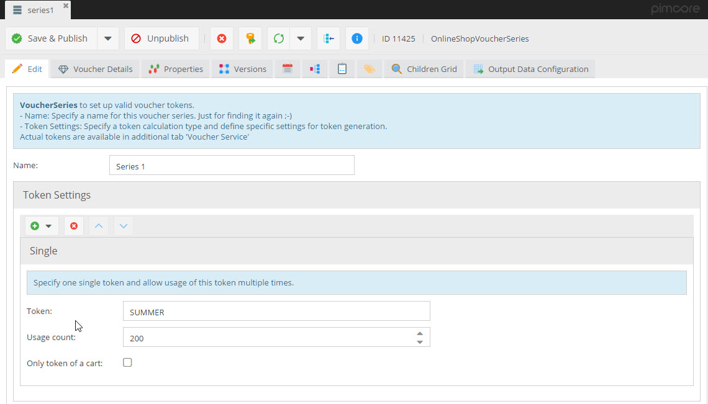

# Vouchers
Like Pricing Rules, also vouchers are supported out of the box by the framework.
To use vouchers, following steps are necessary:  
1) Create an `OnlineShopVoucherSeries` object.
2) Create tokens based on the `OnlineShopVoucherSeries`.
3) Create a Pricing Rule for the `OnlineShopVoucherSeries` and define the benefit of the voucher.
4) Allow the user to add a token to his cart. 


#### Create an `OnlineShopVoucherSeries` object
A voucher series contains basic information of the voucher and settings for creating the voucher tokens. It is 
represented by `OnlineShopVoucherSeries` objects. The corresponding class is added to the system during installation 
of the E-Commerce Framework. 

 
Currently there are two types of vouchers supported - Single and Pattern.
- Single: One single token is defined that can be used multiple times. 

- Pattern: Tokens are generated based on a certain pattern definition. 


#### Create tokens based on the `OnlineShopVoucherSeries`
In the Pimcore Backend UI, each `OnlineShopVoucherSeries` object has an additional tab for managing the voucher tokens. 
Depending on the token type there are different functions for managing the tokens and some statistics concerning the voucher. 
- Simple: 'Activate' the token and specify how often it may be used. 

- Pattern: Create tokens based on the defined pattern, export created tokens as csv and get an overview of created tokens 
and their usages. 


#### Create a Pricing Rule for the `OnlineShopVoucherSeries`
Once a voucher series is defined and tokens are created, a pricing rule has to define the benefits of the voucher. 
To do so, a special condition allows to specify the voucher series the pricing rule should be valid for. As action all 
available actions for pricing rules can be used.


#### Allow the User to Add a Token to his Cart
A voucher token is always applied to a cart. To do so, use following snippet. 
```php
<?php
if ($token = strip_tags($this->getParam('voucherToken'))) {

	try{
        $this->cart->addVoucherToken($token);
    } catch( \Pimcore\Bundle\EcommerceFrameworkBundle\Exception\VoucherServiceException $e ){
        $voucherError = $this->view->t('cart.msg-error.' . $e->getCode());
    }
}

```
#### Error Codes of Exceptions thrown

| Code | Description |
| ---- | ------------------------------------------------------------------ |
| 1    | Token already in use. |
| 2    | Token already reserved. |
| 3    | Token reservation not possible. |
| 4    | No token for this code exists. |
| 5    | Criteria oncePerCart: Token of same series already in cart. |
| 6    | Criteria onlyTokenPerCart: Tokens in cart and tried to add token of type "only". |
| 7    | Criteria onlyTokenPerCart: Token of type "only" already in cart. |
| 8    | No more usages for a single token. |


> Since benefits for vouchers are defined via Pricing Rules, no special actions are needed to display them. 
> They are just displayed the same way as all other Pricing Rules.
